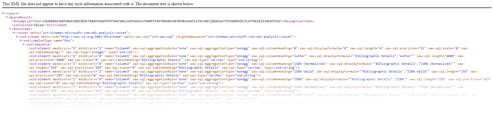
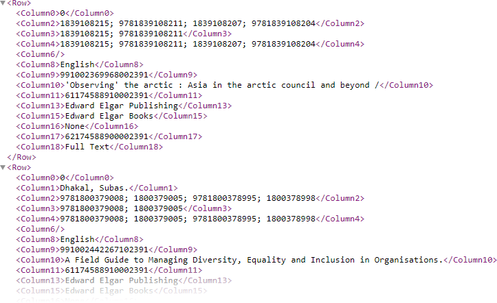

# AlmaAnalyticsAPIcall

*Summary: A project written in R for calling the Alma Analytics API and parsing the XML returned into tabular format.*

The script calls the Alma Analytics API, parses the XML data returned in tabular format, then if there are more calls to be done (there's a hard limit 1000 row limit on any call) it will perform new calls until all data is harvested. These new calls use a "token" parameter instead of the "path" parameter, and the script harvests this token from the XML of the initial call.

To use it, first create a query in Alma Analytics, then record the "path" of the query (check the URL of the page) and other relevant metadata in a .csv file called "config.csv" in the working directory. See "configEXAMPLE.csv" for an example.

**Note**: In an unmodified state, it should be run in RStudio because I use the "rstudioapi" package to interact with the RStudio IDE.
I do this just to check if the user wants to separate any multiple values in the ISBN column into rows.
Also, I check if the user wants to write a .csv file.
This is just me being fancy; feel free to delete out these parts of the script if you want to run it elsewhere.

## How It Works 

This script should in theory work on any Alma Analytics API call, regardless of the structure of the report that one is trying to obtain, despite the complexity of the XML. 

The XML has a schema section which stores the structure of the Alma Analytics report (i.e. the column names). 

The script parses and stores this schema structure in an object called "key_COLHEADS", then uses it to decode the names of the "columns" of the report ("columns" here refers to the XML tags with such names as "Column1" etc.)

---

## Further Reading

### Information on fetching user data can be found here:
- [https://developers.exlibrisgroup.com/alma/apis/analytics/](https://developers.exlibrisgroup.com/alma/apis/analytics/)
- [https://developers.exlibrisgroup.com/blog/Working-with-Analytics-REST-APIs/](https://developers.exlibrisgroup.com/blog/Working-with-Analytics-REST-APIs/)
  
### General reference docs on XML parsing, and the XML2 package
- [https://lecy.github.io/Open-Data-for-Nonprofit-Research/Quick_Guide_to_XML_in_R.html](https://lecy.github.io/Open-Data-for-Nonprofit-Research/Quick_Guide_to_XML_in_R.html)
- [https://www.rdocumentation.org/packages/xml2/versions/1.3.3](https://www.rdocumentation.org/packages/xml2/versions/1.3.3)

### Information on getting XML attributes and their names using "map()"
- [https://community.rstudio.com/t/generate-a-data-frame-from-many-xml-files/10214](https://community.rstudio.com/t/generate-a-data-frame-from-many-xml-files/10214)
